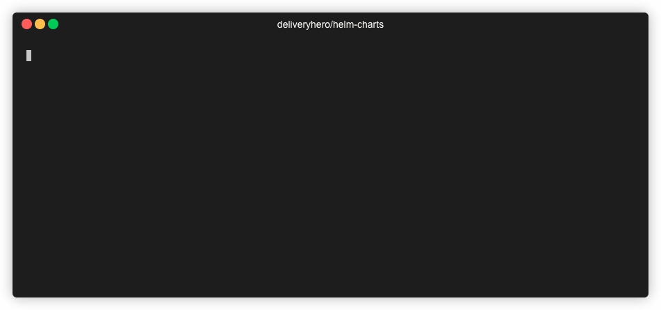

# Helm Charts @ Delivery Hero

[](#)

[Delivery Hero](https://www.deliveryhero.com/) are big fans of Kubernetes and use [Helm](https://helm.sh/) extensively. Here we have collected a few charts that are used across our organisation.

## TLDR

```console
helm repo add deliveryhero https://charts.deliveryhero.io/
helm search repo deliveryhero
helm install my-release deliveryhero/<chart>
```

[](#)

## Chart list

[](https://artifacthub.io/packages/search?repo=deliveryhero)

- [aws-s3-proxy](stable/aws-s3-proxy)
- [aws-service-events-exporter](stable/aws-service-events-exporter)
- [aws-storage-class](stable/aws-storage-class)
- [backstage](stable/backstage)
- [backstage-mono](stable/backstage-mono)
- [cachet](stable/cachet)
- [cloudhealth-collector](stable/cloudhealth-collector)
- [cluster-overprovisioner](stable/cluster-overprovisioner)
- [cortex-gateway](stable/cortex-gateway)
- [datadog-controller](stable/datadog-controller)
- [hoppscotch](stable/hoppscotch)
- [k8s-cloudwatch-adapter](stable/k8s-cloudwatch-adapter)
- [k8s-event-logger](stable/k8s-event-logger)
- [k8s-resources](stable/k8s-resources)
- [kube-bench](stable/kube-bench)
- [kube-downscaler](stable/kube-downscaler)
- [kubecost-reports-exporter](stable/kubecost-reports-exporter)
- [labelsmanager-controller](stable/labelsmanager-controller)
- [listmonk](stable/listmonk)
- [locust](stable/locust)
- [mlflow](stable/mlflow)
- [net-exporter](stable/net-exporter)
- [newrelic-controller](stable/newrelic-controller)
- [node-local-dns](stable/node-local-dns)
- [node-problem-detector](stable/node-problem-detector)
- [pg-repack-scheduler](stable/pg-repack-scheduler)
- [postgres-controller](stable/postgres-controller)
- [priority-class](stable/priority-class)
- [prometheus-aws-costs-exporter](stable/prometheus-aws-costs-exporter)
- [prometheus-aws-health-exporter](stable/prometheus-aws-health-exporter)
- [prometheus-aws-limits-exporter](stable/prometheus-aws-limits-exporter)
- [prometheus-cloudflare-exporter](stable/prometheus-cloudflare-exporter)
- [prometheus-k8s-events-exporter](stable/prometheus-k8s-events-exporter)
- [prometheus-locust-exporter](stable/prometheus-locust-exporter)
- [prometheus-new-relic-app-exporter](stable/prometheus-new-relic-app-exporter)
- [prometheus-new-relic-exporter](stable/prometheus-new-relic-exporter)
- [prometheus-sentry-exporter](stable/prometheus-sentry-exporter)
- [prometheus-soti-mobicontrol-exporter](stable/prometheus-soti-mobicontrol-exporter)
- [prometheus-spot-termination-exporter](stable/prometheus-spot-termination-exporter)
- [prometheus-statsd-exporter](stable/prometheus-statsd-exporter)
- [rds-downscaler](stable/rds-downscaler)
- [service-account](stable/service-account)
- [superset](stable/superset)
- [toxiproxy](stable/toxiproxy)
- [weblate](stable/weblate)
- [wiremock](stable/wiremock)

## Contributing

Contributions are welcome ❤️

This repository has multiple Github Actions to ensure quality is high, these include:

- [chart-testing](https://github.com/helm/chart-testing): lint and install tests
- [markdown-lint](https://github.com/avto-dev/markdown-lint): lint all markdown files
- [helm-docs](https://github.com/norwoodj/helm-docs): check all chart `README.md` have all values documented
- [helm-conftest](https://github.com/instrumenta/helm-conftest): Ensures standard labels are present

All chart `README.md` files are generated from a template. This ensures all values are documented and that formatting is consistent. See [here](https://github.com/norwoodj/helm-docs#valuesyaml-metadata) about how the table of values is produced and how to add descriptions to your chart values.

### Running CI tests locally

All commands to be run from the root of this repo.

`chart-testing`:

  ```console
  brew install chart-testing
  pip3 install yamale yamllint
  ct lint --charts stable/<chart>
  ```

`markdown-lint`:

  ```console
  docker run --rm -v "$PWD:/helm-charts" avtodev/markdown-lint:v1.5.0 --config /helm-charts/ci/markdown-lint.yaml /helm-charts/**/*.md
  ```

`helm-docs`:

  To generate chart `README.md` files from the [template](ci/README.md.gotmpl):

  ```console
  docker run --rm -v "${PWD}:/helm-docs" jnorwood/helm-docs:v1.5.0 --template-files ./ci/README.md.gotmpl
  ```

`helm-conftest`:

  ```console
  brew tap instrumenta/instrumenta
  brew install conftest
  sh ci/helm-conftest.sh
  ```

## License

Contents of this repository and any charts without a specific license are licensed under the Apache-2.0 License. Some charts may have their own respective license at `<chart>/LICENSE`. When adding a new chart to this repository and the chart is copied from another repository then include the license from the source if is not Apache-2.0 and include a link to the source under the `sources` section in `<chart>/Chart.yaml`.
